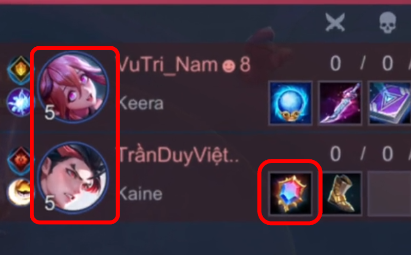
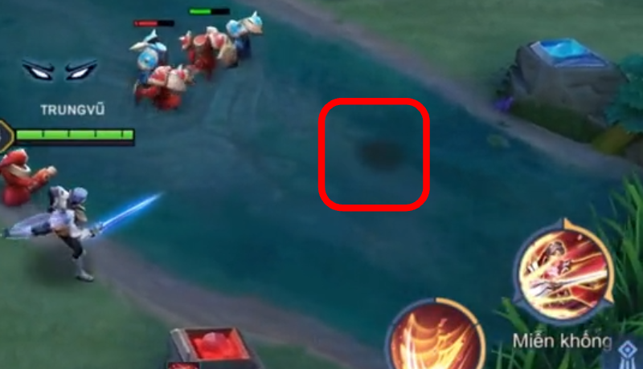

# AOV-BUG-003

## Keera Makes Players Who Buy Support Items Have Their Vision Revealed.

---

## Bug Information

| Field     | Value                       |
| --------- | --------------------------- |
| Bug ID    | AOV-BUG-003                 |
| Module    | Fog of War / Hero Rendering |
| Category  | Gameplay                    |
| Severity  | High                        |
| Priority  | High                        |
| Frequency | Always                      |
| Status    | Open                        |

---

## Environment

| Item     | Value        |
| -------- | ------------ |
| Version  | 1.63.1.5     |
| Map      | All maps     |
| Modes    | All modes    |
| Hero     | Keera        |
| Platform | Android, iOS |
| Device   | all device   |

---

## Description

When a support item is purchased during a match where Keera is present, she will expose the vision of both teammate and enemy support.

Although Keera remains obscured by the War Mist, the visible shadows of the lodgers inadvertently reveal their precise location.

---

## Preconditions

- Aay map.
- Keera is present in the match.
- Another player purchases a support item.
- Their shadow will be visible in the Fog of War.

---

## Reproduction Steps

1. Start a random game with Keera.
2. Any player purchase a support item.
3. They will reveal their shadow in the Fog of War.

---

## Expected Result

All player should remain completely hidden while outside the enemy's vision.

No visual elements should reveal support's position.

---

## Actual Result

Support's shadow becomes visible despite remaining outside the enemy's vision range.

The shadow exposes Kera's approximate location.

---

## Impact

This issue unintentionally reveals hidden information to both teams.

Possible impacts include:

- Reduced effectiveness of ambushes.
- Loss of strategic positioning.
- Unfair information advantage.
- Gameplay balance issues involving Kera.

---

## Business Impact

This issue affects competitive fairness by exposing information that should remain hidden under the Fog of War system.

Players may lose confidence in the reliability of stealth and vision mechanics.

---

## Attachments

### Video Demonstration

### Evidence 1

### Evidence 2

---

## Regression Verification

Pending

---

## Tester Observation

The issue occurs immediately after a support item is purchased.

Only support's shadow is revealed, while the hero model itself remains hidden.

The issue appears to occur consistently throughout the match.
