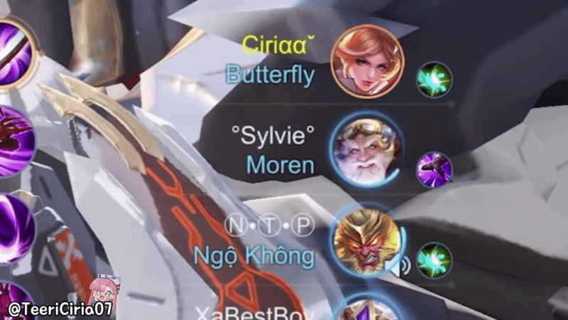
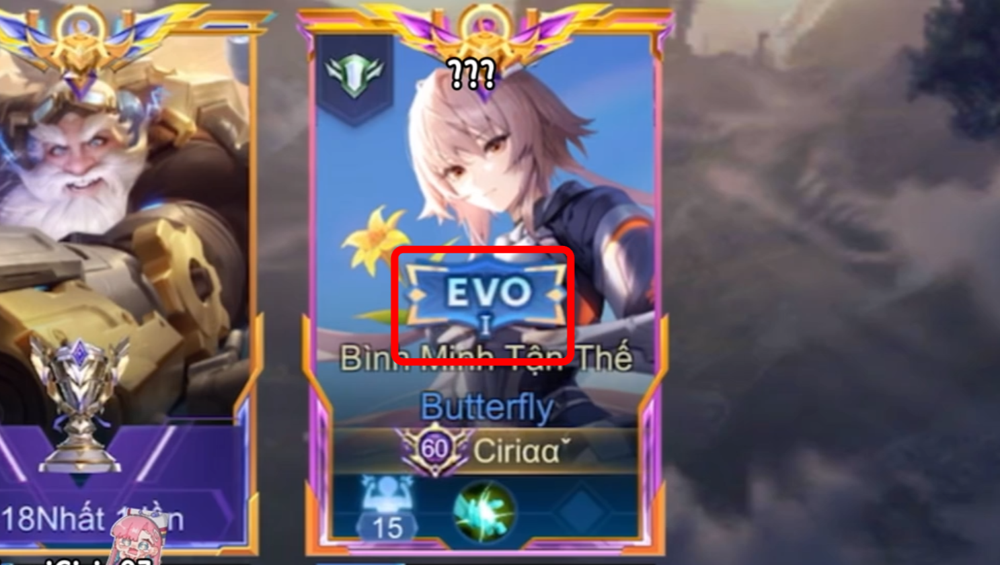

# AOV-BUG-004

## EVO Skin Progression Resets to Base Level After Teammate Interaction During Hero Selection

---

## Bug Information

| Field     | Value                            |
| --------- | -------------------------------- |
| Bug ID    | AOV-BUG-004                      |
| Module    | Hero Selection / EVO Skin System |
| Category  | Gameplay / Cosmetic              |
| Severity  | Low                              |
| Priority  | Low                              |
| Frequency | Always                           |
| Status    | Open                             |

---

## Environment

| Item     | Value                                               |
| -------- | --------------------------------------------------- |
| Version  | 1.63.1.5                                            |
| Map      | All maps                                            |
| Modes    | All modes                                           |
| Skin     | Valhein EVO, Wukong EVO, Nakroth EVO, Butterfly EVO |
| Platform | Android, iOS                                        |
| Device   | all device                                          |

---

## Description

When using an EVO skin, if a teammate sends a "Taunt" interaction during the Hero Selection phase, the EVO skin loses its progression level after entering the match.

Instead of displaying the selected EVO level, the skin is reset to its base evolution stage.

---

## Preconditions

- Own an EVO skin with multiple evolution levels.
- Select the EVO skin during Hero Selection.
- At least one teammate is able to send a Taunt interaction.

---

## Reproduction Steps

1. Start a match.
2. Enter the Hero Selection phase.
3. Select a hero equipped with an EVO skin.
4. Ensure the EVO skin is set to a higher evolution level.
5. Ask a teammate to send a Taunt interaction during Hero Selection.
6. Complete Hero Selection and enter the match.

---

## Expected Result

The selected EVO evolution level should remain unchanged after entering the match.

---

## Actual Result

The EVO skin is displayed at its lowest evolution level after entering the match.

---

## Impact

- Cosmetic progression is not preserved.
- Players cannot use the EVO level they selected.
- The visual experience of premium skins is affected.
- May reduce player satisfaction with paid cosmetic content.

---

## Business Impact

This issue affects premium cosmetic content and may negatively impact player confidence in EVO skins.

Because EVO skins are monetized content, failures to preserve selected progression levels can reduce perceived product quality.

---

## Attachments

- Video demonstration (BUG-004)
  

- Evidence 1 (BUG-004)
  

---

## Regression Verification

Pending

---

## Tester Observation

The issue only occurs after a teammate performs an interaction (Emote/Taunt) during the Hero Selection phase.

The selected EVO level is correctly configured before the match starts but is reset immediately after loading into the game.

The issue is reproducible in every test performed (100% reproduction rate).
